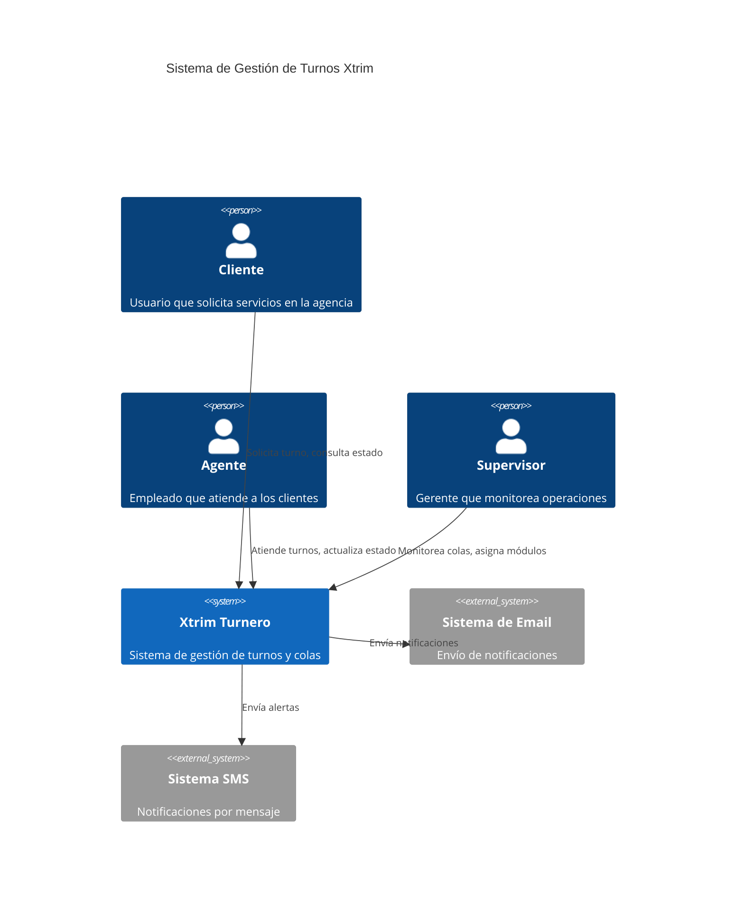
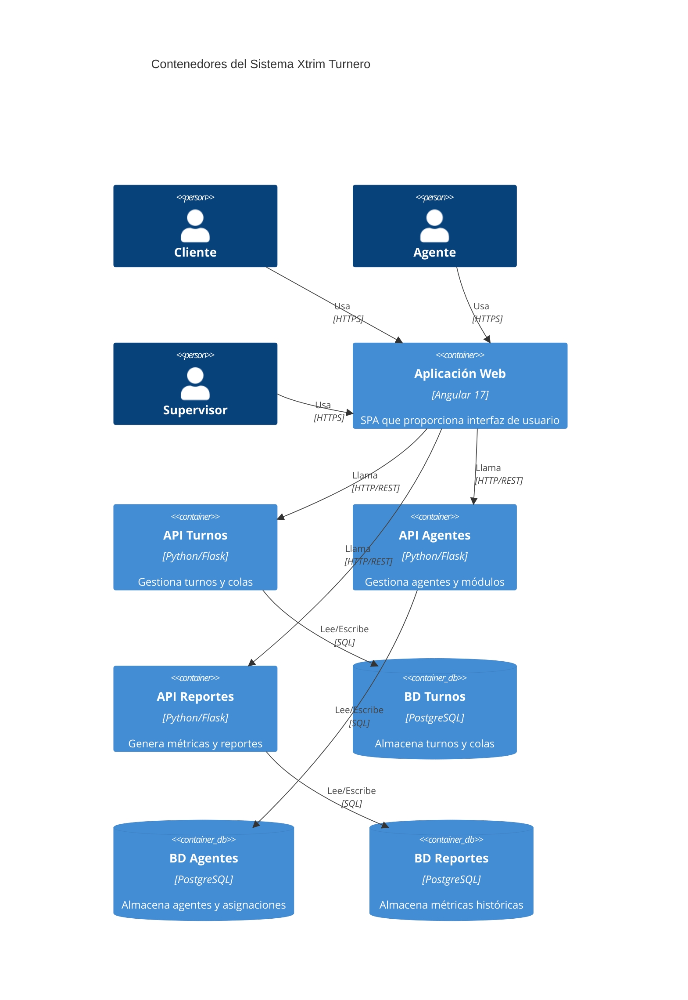
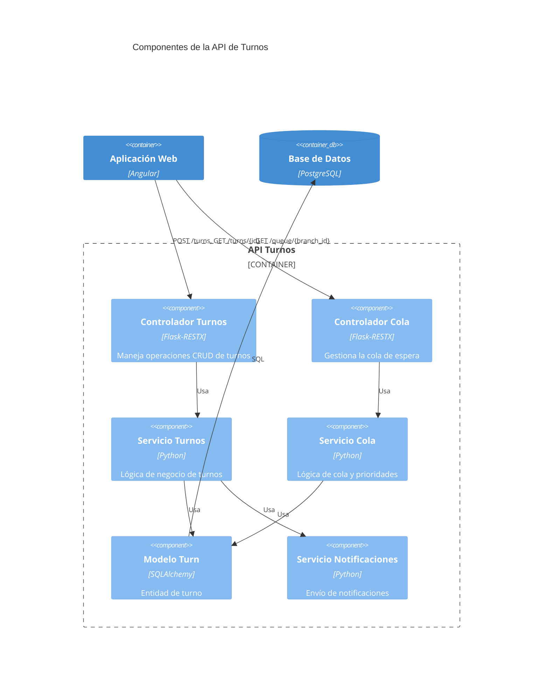
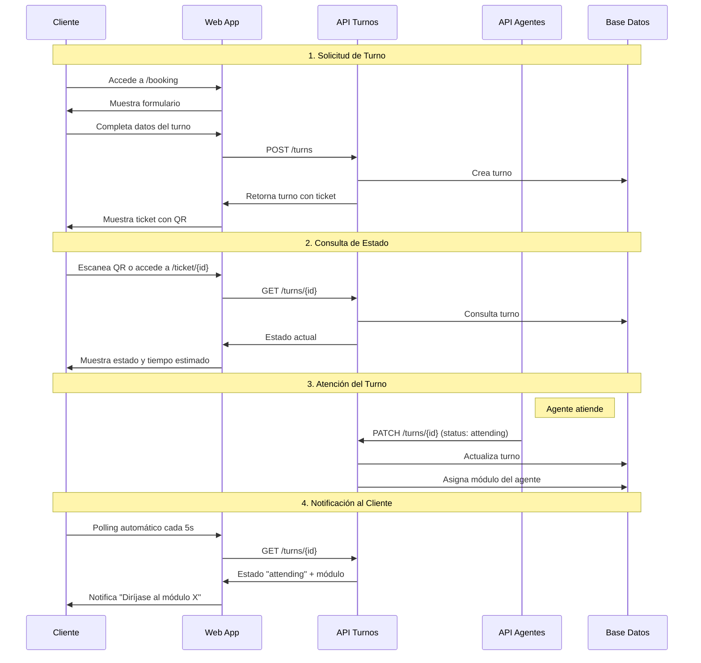
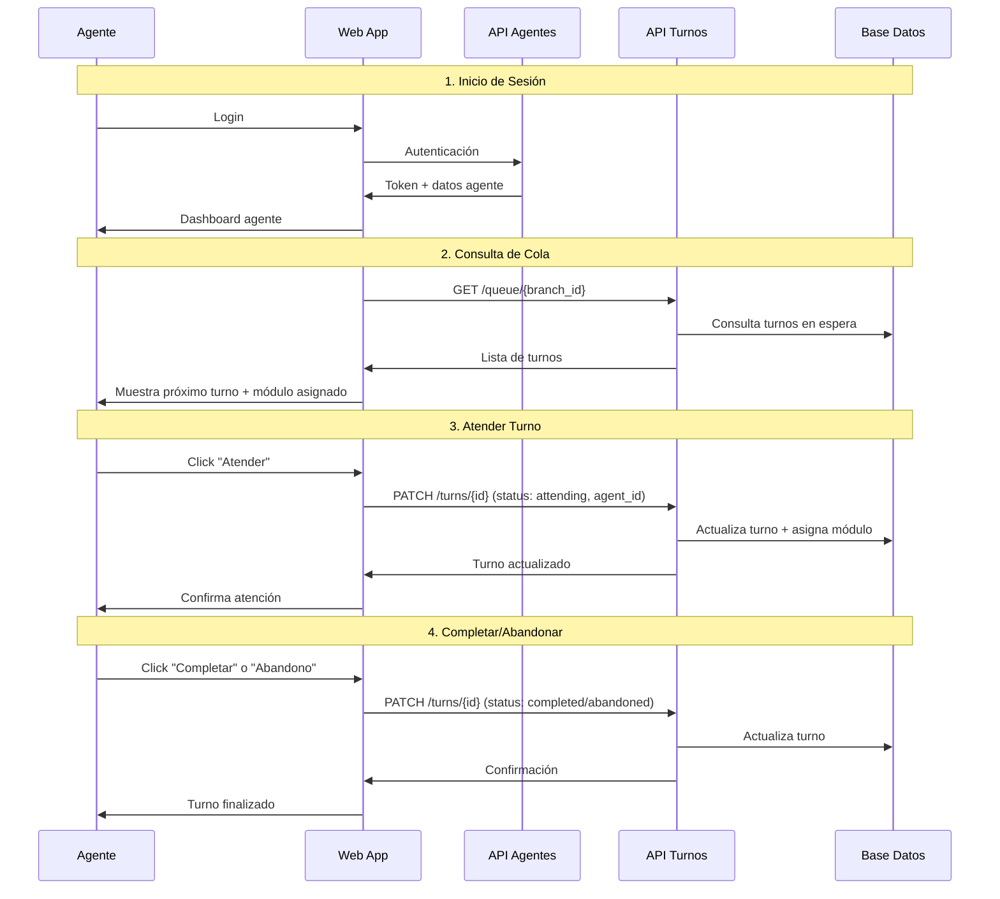
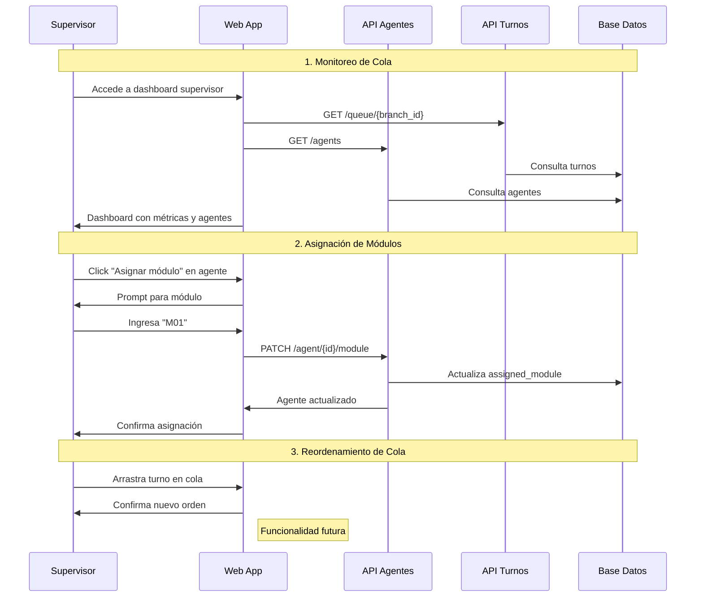

# Arquitectura del Sistema Xtrim Turnero

## Resumen Ejecutivo

Xtrim Turnero es un sistema de gestión de turnos para agencias Xtrim que permite a los clientes tomar turnos, a los agentes atenderlos y a los supervisores monitorear las operaciones. El sistema está construido con una arquitectura de microservicios usando Angular para el frontend y Python/Flask para el backend.

## Diagrama C4 - Nivel 1: Contexto del Sistema



## Diagrama C4 - Nivel 2: Contenedores



## Diagrama C4 - Nivel 3: Componentes (API Turnos)



## Flujo del Cliente



## Flujo del Agente



## Flujo del Supervisor



## Arquitectura Técnica

### Frontend (Angular 17)
- **Componentes**: Booking, Ticket, Agent, Supervisor, Monitor
- **Servicios**: TurnsService, AgentsService, AuthService
- **Estado**: NgRx para gestión de estado global
- **UI**: Angular Material + Tailwind CSS
- **Comunicación**: HTTP Client para APIs REST

### Backend (Microservicios Python)

#### Servicio de Turnos (Puerto 5000)
- **Framework**: Flask 2.x + Flask-RESTX
- **Base de Datos**: PostgreSQL (turnos, colas)
- **Endpoints**:
  - `POST /turns` - Crear turno
  - `GET /turns/{id}` - Consultar turno
  - `PATCH /turns/{id}` - Actualizar estado
  - `GET /queue/{branch_id}` - Obtener cola

#### Servicio de Agentes (Puerto 5001)
- **Framework**: Flask 2.x + Flask-RESTX
- **Base de Datos**: PostgreSQL (agentes, módulos)
- **Endpoints**:
  - `GET /agent` - Listar agentes
  - `POST /agent` - Crear agente
  - `PATCH /agent/{id}/status` - Cambiar estado
  - `PATCH /agent/{id}/module` - Asignar módulo

#### Servicio de Reportes (Puerto 5002)
- **Framework**: Flask 2.x + Flask-RESTX
- **Base de Datos**: PostgreSQL (métricas)
- **Funcionalidad**: Exportación CSV, métricas históricas

### Base de Datos

#### Tabla `turns`
```sql
- id (PK)
- ticket_number (UNIQUE)
- branch_id
- turn_type (normal/preferential)
- reason
- status (waiting/attending/completed/abandoned)
- customer_name, customer_cedula, customer_email
- created_at, called_at, completed_at
- agent_id
- assigned_module
```

#### Tabla `agents`
```sql
- id (PK)
- name
- email (UNIQUE)
- password
- role (AGENTE/SUPERVISOR)
- branch_id
- status (disponible/no_disponible)
- unavailability_reason
- assigned_module
- last_status_change
- created_at
```

## Patrones de Diseño Implementados

1. **Microservicios**: Separación por dominio de negocio
2. **Repository Pattern**: Abstracción de acceso a datos
3. **Service Layer**: Lógica de negocio separada
4. **Observer Pattern**: Polling para actualizaciones en tiempo real
5. **Factory Pattern**: Generación de números de ticket
6. **State Pattern**: Estados de turnos y agentes

## Consideraciones de Seguridad

- **CORS**: Configurado para permitir frontend
- **Validación**: Entrada validada en todos los endpoints
- **Logging**: Trazabilidad completa con Loguru
- **Error Handling**: Manejo centralizado de errores

## Escalabilidad y Performance

- **Containerización**: Docker para despliegue
- **Base de Datos**: Índices en campos de consulta frecuente
- **Caching**: Potencial para Redis en consultas de cola
- **Load Balancing**: Preparado para múltiples instancias

## Monitoreo y Observabilidad

- **Logs Estructurados**: JSON con Loguru
- **Health Checks**: Endpoints de salud en cada servicio
- **Métricas**: Tiempo de respuesta y contadores
- **Trazabilidad**: Request ID para seguimiento

## Próximas Mejoras

1. **WebSockets**: Actualizaciones en tiempo real
2. **Notificaciones Push**: PWA con service workers
3. **Métricas Avanzadas**: Dashboard de KPIs
4. **API Gateway**: Punto único de entrada
5. **Autenticación JWT**: Seguridad mejorada
6. **Cache Redis**: Performance optimizada
7. **CI/CD Pipeline**: Despliegue automatizado